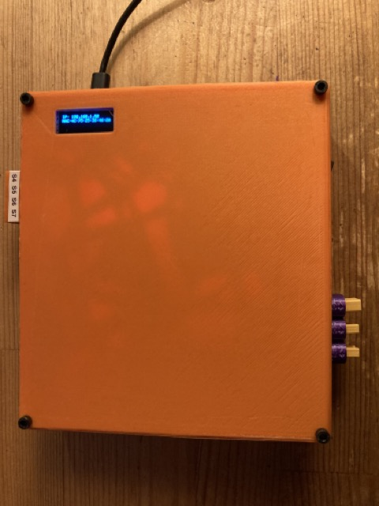
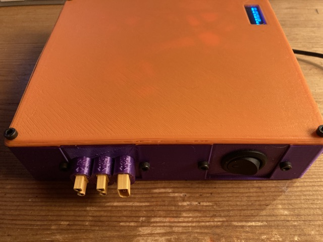

# HLRobotController

This repository contains source code for the firmware on the HL RobotController.The device consists of a NodeMCU ESP8266 WiFi enabled microcontroller, two L298N dual channel DC motor controllers, one PCA9865 16 channel PWM, and a couple of DC-DC buck converters.

The device is intended to be used for controlling small robots. It has external connections for **4 DC motors** and **8 servo motors**. Input power is via an XT30 connector and should be in the 9V-15V range. There are two other XT30 connectors providing output power controlled by the power switch so it can be used to turn power on/off for other devices as well.

Upon powering on, the device will attempt to connect to the local WiFi network via saved creditials. If it is unable to, it will create a special Access Point network called "HLRobotController" you can temporarily connect to. This generally will automatically open a web page where you can then enter the SSID and password for the local WiFi network.

The device can then be controlled via WebSockets using **port 81**. The assigned IP address will be shown on the display on the device itself. A built-in webserver will provide a page that communicates with the device via WebSockets. Just point a web browser to the IP address. There are also rudimentary controls that can be used to test the motors.

A link to an [example python script](data/gamepad_example.py) for controling the device via Python is also available through the device's web page. The script takes input from a Logitech F310 game controller so you can, in principle, start using it immediately.

Note that files in the [data](data) directory needed to be uploaded to the device in addition to the firmware. See comments in the platformio.ini file for details.

This firmware includes an OTA (Over-The_Air) updater (port 8266) that can be used to update the firmware over WiFi.

